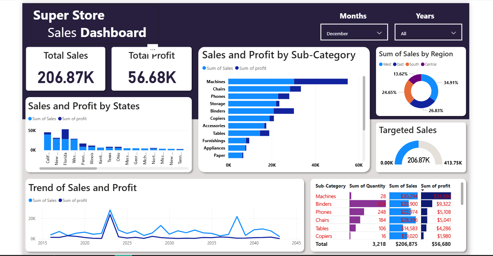
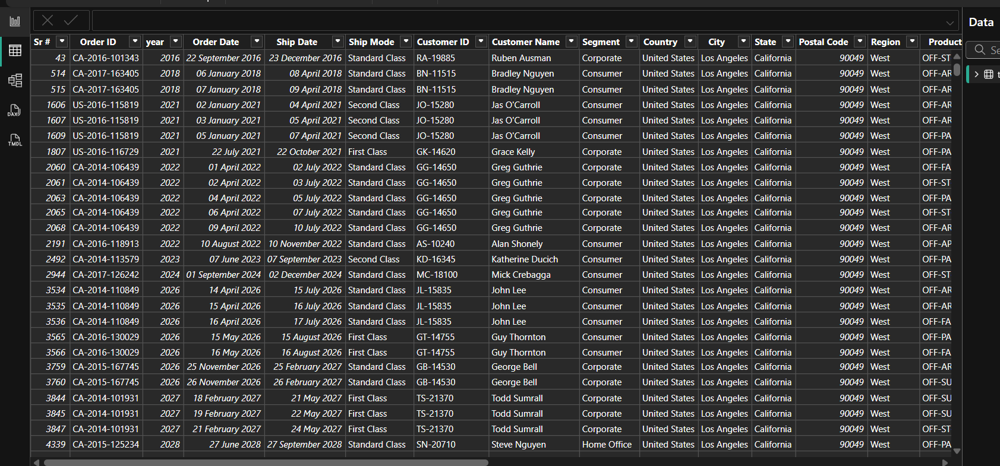

# 📊 Superstore Sales Dashboard (Power BI)

This project presents an **interactive Superstore Sales Dashboard** built in Power BI to analyze sales performance, profitability, and regional trends. The dashboard provides quick KPIs and drill-down insights to support data-driven decisions.  

---

## 📌 Key Metrics (Cards)
- 💰 **Total Sales** – Overall revenue generated.  
- 📈 **Total Profit** – Net profit across all categories.  

---

## 📊 Visualizations  

### 🔹 Performance by Category
- **Bar Chart** – Sales and Profit by **Sub-Category**, highlighting profitable and underperforming items.  

### 🔹 Regional & Target Analysis
- **Doughnut Chart** – Share of total sales across **Regions**.  
- **Gauge Chart** – **Targeted Sales** performance vs. actual sales.  

### 🔹 Trends Over Time
- **Line Chart** – Sales and Profit trends over time (dual line chart).  

### 🔹 Detailed Insights
- **Table Chart with Bars** – Tabular report enriched with in-cell bar visuals to compare sales and profit values at a glance.  

---

## 🚀 Features
- Interactive slicers for filtering by **Region, Category, and Sub-Category**.  
- KPI cards for quick executive insights.  
- Clear comparison of **sales vs. profit** across different views.  
- Clean and professional UI design.  

## 🖼️ Preview  

